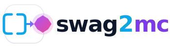

<p>
    <a href="https://github.com/mmadfox/swag2mcp/releases"></a>
    <a href="https://pkg.go.dev/github.com/mmadfox/swag2mcp?tab=doc"></a>
    <a href="https://github.com/mmadfox/swag2mcp/actions"></a>
    <a href="https://coveralls.io/github/mmadfox/swag2mcp?branch=main"></a>
</p>

> ⚠️ **Work in progress** — API may change, contributions welcome.

**swag2mcp** bridges OpenAPI/Swagger/Postman API specifications with LLM agents via the Model Context Protocol (MCP).

- **16 MCP tools** for discovering, inspecting, and invoking APIs
- **Interactive TUI explorer** with full-text search
- **Zero integration code** — just point to your specs and go

---

- <a href="https://mmadfox.github.io/swag2mcp/getting-started/installation" target="_blank" rel="noopener noreferrer">Installation</a>
- <a href="https://mmadfox.github.io/swag2mcp/getting-started/quickstart" target="_blank" rel="noopener noreferrer">Quickstart</a>
- <a href="https://mmadfox.github.io/swag2mcp" target="_blank" rel="noopener noreferrer">Documentation</a>

---

## License

Licensed under the **GNU Affero General Public License v3.0** (AGPL v3).

See [LICENSE](LICENSE) for the full license text.

```
SPDX-License-Identifier: AGPL-3.0-only
```
