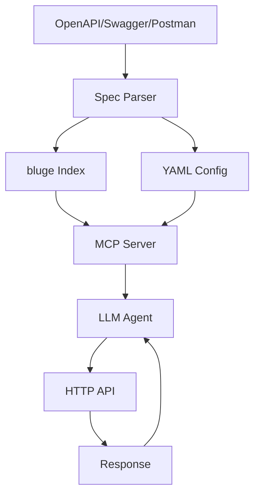

# Concepts

## Architecture

swag2mcp acts as a bridge between API specifications and LLM agents:



## Core Concepts

| Concept | Description |
|---------|-------------|
| **Spec** | OpenAPI/Swagger/Postman file describing an API |
| **Collection** | Logical group of endpoints within a spec |
| **Tag** | Category of endpoints within a collection |
| **Endpoint** | Specific HTTP method + path |
| **Workspace** | Directory with config, cache, and specs |

## Hierarchy

```
Spec (OpenAPI file)
  └── Collection 1 (logical group)
        └── Tag 1 (category)
              └── Endpoint (GET /api/users)
              └── Endpoint (POST /api/users)
        └── Tag 2
              └── Endpoint (GET /api/users/{id})
  └── Collection 2
        └── Tag 3
              └── Endpoint (DELETE /api/users/{id})
```

## Data Flow

1. **Parsing**: spec is loaded and parsed (OpenAPI 3.x, Swagger 2.0, or Postman)
2. **Indexing**: endpoints are indexed in bluge for full-text search
3. **Service**: MCP server provides 19 tools for API interaction
4. **Invocation**: LLM agent calls endpoints via MCP protocol
5. **Response**: result returned to agent, large responses saved to disk
