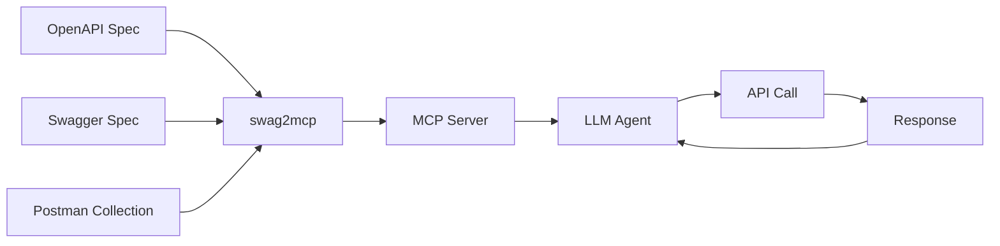

# swag2mcp

**swag2mcp** bridges OpenAPI/Swagger/Postman API specifications with LLM agents via the Model Context Protocol (MCP).



## Features

- **19 MCP tools** for discovering, inspecting, and invoking APIs
- **9 auth methods**: Basic, Bearer, Digest, HMAC, OAuth2, API Key, Script
- **Full-text search** across all endpoints via bluge
- **Interactive TUI** explorer
- **Mock server** for development and testing
- **3 transports**: stdio, SSE, Streamable HTTP
- **OpenAPI 3.x**, Swagger 2.0, Postman Collections
- **Cascade config**: global → spec → collection
- **Rate limiting**: 10s per endpoint
- **Response size management**: auto-save large responses to disk
- **Export/Import** workspace as ZIP
- **7 languages** documentation

## Quick Start

```bash
# Install
go install github.com/mmadfox/swag2mcp@latest

# Initialize workspace
swag2mcp init

# Add an API spec
swag2mcp add https://api.example.com/openapi.json

# Start MCP server
swag2mcp mcp
```

## Integration

| Client | Transport | Status |
|--------|-----------|--------|
| OpenCode | stdio / HTTP | ✅ |
| Cursor | stdio | ✅ |
| Claude Desktop | stdio | ✅ |
| VS Code | stdio | ✅ |
| Crush | stdio / HTTP | ✅ |

## License

MIT License
